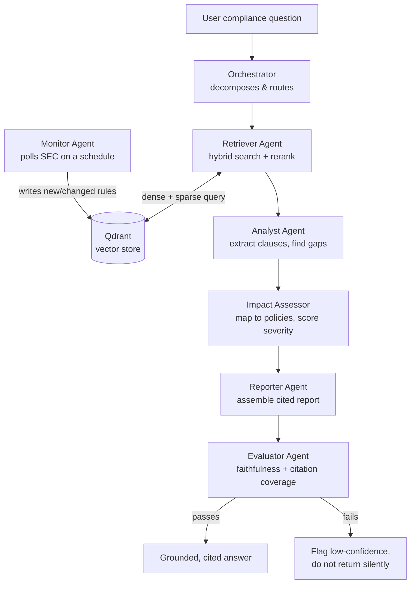

# Regulatory Intelligence System

> A multi-agent, retrieval-augmented AI system that reads live regulatory filings and a company's own internal documents, then answers compliance questions with **grounded, cited, self-checked** reports.

Built as a demonstration of **multi-agent orchestration** for real-world, high-stakes document reasoning. Runs on open models served via [Ollama](https://ollama.com) — minimal local footprint, no per-token API bill, and your private documents never leave your environment.

---

## 1. The problem (in plain terms)

Every company in a regulated industry — finance, healthcare, pharma — has to obey two stacks of rules at once:

1. **External regulations** that keep changing. The U.S. Securities and Exchange Commission (SEC), the FDA, the EU, and others publish new rules, guidance, and enforcement filings constantly.
2. **Internal documents** the company wrote to comply — policies, standard operating procedures (SOPs), contracts.

The hard, expensive, error-prone job is keeping those two stacks **in sync**:

> *"A new SEC rule just came out. Does our insider-trading policy already cover it, or is there a gap? Which of our SOPs need to change? How serious is it?"*

Today this is done by teams of compliance officers and lawyers reading thousands of pages by hand. It's slow, it doesn't scale, and a missed gap can mean fines, lawsuits, or worse.

**What people have tried, and why it falls short:**

- **Keyword search** finds documents that contain a word, but not documents that *mean* the same thing in different words ("blackout window" vs. "trading restriction period").
- **A single chatbot ("just ask ChatGPT")** will confidently *make things up* (hallucinate), can't cite where its answer came from, and has no knowledge of the company's private documents or of regulations published after its training cutoff.

What's actually needed is a system that:

- **Reads the real, current regulations** (not a stale training snapshot),
- **Reads the company's private documents** too,
- **Reasons across both** to find gaps and score their severity,
- and crucially **shows its work** — every claim traceable to a specific passage, with an automatic check that it didn't hallucinate.

That's what this system does.

---

## 2. What the system does (the elevator pitch)

You ask a compliance question in plain English. The system:

1. Pulls the relevant **live SEC filings** and the relevant **internal company documents**.
2. Extracts the specific clauses that matter and identifies **gaps** between what regulators require and what the company's documents say.
3. Scores **how severe** each gap is and which internal policies are affected.
4. Writes a **report with inline citations** — every statement points back to the exact source passage.
5. **Grades its own answer** for faithfulness (did it stick to the sources?) and citation coverage, and flags low-confidence answers *before* you ever see them.

No hallucinated regulations. No "trust me." Every answer is sourced and audited.

---

## 3. How the AI solves it (the deep dive)

The core idea is **Retrieval-Augmented Generation (RAG)** done rigorously, driven by a **team of specialized AI agents** instead of one monolithic prompt. Each agent does one job well, and they pass structured state between each other.

### 3.1 Why multiple agents instead of one big prompt?

A single prompt that tries to "find the docs, analyze gaps, score severity, write the report, and check itself" does all of those *mediocrely* and is impossible to debug. Splitting the work into specialists gives you:

- **Separation of concerns** — each agent has one responsibility and a well-defined input/output contract.
- **Independent testability** — you can verify the retriever without running the writer.
- **Targeted model routing** — cheap models do easy jobs, strong models do hard reasoning (see §3.5).
- **A real audit trail** — you can inspect exactly what each agent saw and produced.

The agents are coordinated by an **orchestrator** built on [LangGraph](https://langchain-ai.github.io/langgraph/), which models the whole pipeline as a **typed state machine**: a single `AgentState` object flows through the graph, and each agent reads from and writes to it. This is message-passing via shared typed state, not brittle prompt-chaining.



### 3.2 Finding the right information: hybrid retrieval

When you ask a question, the system has to find the most relevant passages out of potentially thousands of chunks. Naive approaches each have a blind spot, so we combine two complementary ones:

- **Dense (semantic) search** — every text chunk is turned into a 1024-dimensional vector (an *embedding*) by the `bge-m3` model. Chunks with similar *meaning* land near each other in vector space, so "blackout window" matches "trading restriction period" even with no shared words.
- **Sparse (lexical / BM25) search** — classic keyword relevance. This catches exact terms, regulation IDs, and rare jargon that semantic search can blur (e.g. "Rule 17a-4").

Both run as separate queries, and their results are merged with **Reciprocal Rank Fusion (RRF)** *inside the vector database* (Qdrant). Fusing the two gives markedly better recall than either alone — you get both "means the same thing" and "says the exact thing."

Every chunk also carries **metadata** (jurisdiction, document type, source, dates, SEC form type, accession number), so retrieval can be **filtered**: the retriever can scope to `jurisdiction = US-SEC`, the impact assessor can scope to `source = internal`, and so on.

### 3.3 Re-ranking: a second, smarter opinion

Fusion gives ~20 strong candidates, but ranking by vector similarity alone is imperfect. So a **reranker** takes those candidates and re-orders them by actual relevance to the question. Here it's done **listwise by an LLM**: the model reads the question and all candidates at once and returns a ranked order *with a one-line rationale for each* — which doubles as explainability. (This approach also keeps zero extra models on disk versus a dedicated cross-encoder.)

### 3.4 Grounding, gap analysis, and self-evaluation

- The **Analyst** extracts the specific clauses from retrieved regulations and compares them against the company's internal documents to surface **gaps and overlaps**.
- The **Impact Assessor** maps each regulatory change to the specific internal policies it affects and assigns a **severity score**.
- The **Reporter** assembles the final answer with **chunk-level citations** — every claim links to its source passage.
- The **Evaluator** is the trust layer. After the answer is written, it scores **faithfulness** (is every statement actually supported by the retrieved sources, or did the model drift?), **citation coverage**, and **cross-chunk conflicts**, using a combination of [RAGAS](https://docs.ragas.io/) metrics and an LLM acting as judge. Low-faithfulness answers are **flagged rather than silently returned**.

This is the difference between a demo chatbot and something you could put in front of a compliance officer: the system refuses to pretend it's sure when it isn't.

### 3.5 Smart, pluggable model routing

LLM calls go through a **provider abstraction**, so any agent can be backed by a different model with a config change — no code rewrite. The default routing is **tiered to match difficulty**:

| Work | Model | Why |
|---|---|---|
| Extraction, report assembly, orchestration, reranking | `gpt-oss:120b` (Ollama) | Fast, capable enough, cheap |
| Gap-impact reasoning, faithfulness judging | frontier model (`kimi-k2.6` / `deepseek-v4-pro`, Ollama) | Multi-hop reasoning where quality matters most |

Embeddings (`bge-m3`) run locally too. The result: the whole runtime can operate on locally-served open models — reproducible, private, and free of per-token cost — while remaining one config line away from swapping in a hosted model (e.g. Claude) for any single agent.

Structured outputs (severity scores, citation objects, rerank orderings) are produced via **JSON-schema-constrained generation**, so the open models stay in a machine-parseable shape instead of drifting into free text.

### 3.6 Always-current knowledge

The **Monitor Agent** runs on a schedule (decoupled from query time), polls SEC EDGAR, detects new or changed filings, and writes them into the vector store with a change-log. So the system answers against *today's* regulations, not a frozen snapshot — solving the "stale training data" problem that plagues a plain chatbot.

---

## 4. Tech stack

| Concern | Choice |
|---|---|
| Agent orchestration | **LangGraph** (typed `StateGraph`, conditional edges) |
| Vector store | **Qdrant** (named dense + sparse vectors, payload filtering, server-side RRF) |
| Embeddings | **bge-m3** via Ollama (1024-dim dense) |
| Lexical search | **FastEmbed BM25** (sparse, non-neural — kilobytes on disk) |
| Reranking | **LLM listwise** via Ollama |
| LLMs | **Ollama** open models (gpt-oss, kimi, deepseek), pluggable to Claude |
| Evaluation | **RAGAS** + custom LLM-as-judge faithfulness scorer |
| Live data | **SEC EDGAR** (`data.sec.gov` / `efts.sec.gov`, no API key) |
| Ingestion | LangChain text splitting, on-disk cache, rate-limited fetch |
| Runtime | Python 3.12, `uv`, FastAPI (API + UI), Docker (Qdrant) |

---

## 5. Project status

This is being built in phases; each phase is independently testable.

| Phase | Scope | Status |
|---|---|---|
| **0** | Foundations: config, pluggable LLM layer, typed `AgentState`, Qdrant schema | ✅ **Done** |
| **1** | Ingestion + retrieval spine: SEC EDGAR client, hybrid search + RRF, LLM reranker, `RetrieverAgent` | ✅ **Done** |
| **2** | Orchestration + reasoning: LangGraph graph with dynamic query-type routing, Orchestrator, Analyst, Impact Assessor, Reporter | ✅ **Done** |
| **3** | Evaluation: Evaluator agent (RAGAS-style LLM-as-judge) — faithfulness, citation coverage, conflict detection; low-confidence flagging | ✅ **Done** |
| 4 | Monitor + scheduling: APScheduler SEC polling, diff detection, change-log | 🔜 Next |
| 5 | API + UI: FastAPI endpoints, minimal web UI, demo polish | ⬜ Planned |

**What works today:** the full multi-agent pipeline. Ingest **full-text live SEC filings** + synthetic internal docs, then ask a compliance question and get back a **classified, grounded, cited report**: the Orchestrator routes by query type (LOOKUP / GAP_CHECK / IMPACT), the Retriever does hybrid search + LLM rerank, the Analyst extracts clauses and finds gaps, the ImpactAssessor (frontier model) scores severity and affected policies, the Reporter writes the answer with inline citations resolved to real passages, and the **Evaluator** (frontier model) grades it for faithfulness, citation coverage, and cross-chunk conflicts — flagging low-confidence answers. 88 automated tests pass, plus live end-to-end tests against real models. Example — *"Does our insider trading policy comply with SEC blackout window requirements?"* returns: **GAP_CHECK → "No"**, citing real DocuSign/SentinelOne SEC insider-trading policies and the internal ACME policy, with a **high-severity** impact on the affected internal policy.

**Engineering note (Ollama Cloud structured output):** Ollama *Cloud* models do not enforce the `format` JSON-schema parameter the way local models do. The LLM provider therefore embeds the schema directly in the prompt and parses the result robustly (fence-stripping + balanced-JSON extraction), so structured outputs (classifications, findings, severity scores, citations) stay reliable on cloud-served open models.

> Note: the full query-time pipeline — Orchestrator, Retriever, Analyst, Impact Assessor, Reporter, **and Evaluator** — is implemented today. The scheduled Monitor (Phase 4) is designed and on the roadmap below.

Design specs and the task-by-task implementation plan live in [`docs/superpowers/`](docs/superpowers/).

---

## 6. Setup

```bash
# 1. Install dependencies (uv creates the virtualenv and resolves everything)
uv sync

# 2. Configure
cp .env.example .env
#    then set SEC_USER_AGENT to "Your Name your@email" (SEC requires a descriptive UA)

# 3. Pull the embedding model (chat models are served via Ollama Cloud)
ollama pull bge-m3

# 4. Start the vector store
docker compose up -d            # or set QDRANT_EMBEDDED=true in .env to skip Docker
```

## 7. Demo

```bash
# Ingest live SEC filings + the synthetic internal corpus
uv run python -m regintel.cli ingest --sec-query "insider trading policy" --sec-limit 5

# Full multi-agent report: classify -> retrieve -> analyze -> assess -> cited report
uv run python -m regintel.cli ask \
  "Does our insider trading policy comply with SEC blackout window requirements?"

# Or just the raw retrieval layer (ranked, reranked passages with rationales)
uv run python -m regintel.cli query \
  "What are our obligations around insider trading?" --jurisdiction US-SEC
```

## 8. Tests

```bash
uv run pytest            # fast unit + integration tests (network/models mocked)
uv run pytest -m live    # live end-to-end (requires Ollama running + embedded Qdrant)
```

---

## 9. Repository layout

```
src/regintel/
  config.py            # settings (model routing, Qdrant, SEC UA)
  state.py             # typed AgentState (LangGraph)
  types.py             # shared retrieval types
  llm/                 # pluggable provider layer (Ollama, Claude, role router)
  embeddings/          # bge-m3 dense + FastEmbed BM25 sparse
  store/               # Qdrant schema + hybrid RRF search
  ingest/              # SEC EDGAR client, internal docs, chunker, pipeline
  rerank/              # LLM listwise reranker
  agents/              # RetrieverAgent (more agents in Phase 2+)
  cli.py               # ingest / query commands
data/internal/         # synthetic compliance corpus (tracked)
docs/superpowers/      # design specs + implementation plans
tests/                 # unit, integration, and live tests
```
