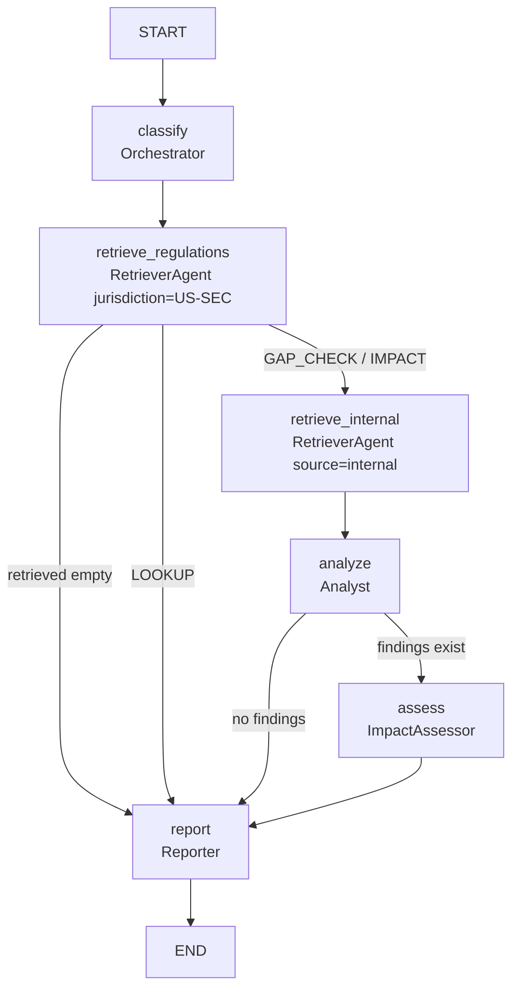

# Regulatory Intelligence System — Phase 2 Design (Orchestration + Reasoning)

**Date:** 2026-06-12
**Status:** Approved (brainstorming) — continuous execution authorized by user
**Scope:** Phase 2 — the LangGraph multi-agent core: Orchestrator (dynamic query-type routing), Analyst (clause extraction + gap analysis), ImpactAssessor (affected policies + severity), Reporter (cited answer assembly). Builds on the Phase 0+1 retrieval spine.

---

## 1. Context

Phase 0+1 delivered the retrieval spine: a pluggable LLM layer, a shared Qdrant `corpus` collection (dense bge-m3 + sparse BM25, RRF fusion, payload filters), live SEC EDGAR full-body ingestion, synthetic internal docs, and a `RetrieverAgent` (hybrid → LLM rerank). Phase 2 turns retrieval into **answers**: a graph of specialist agents that classify the question, gather the right evidence, find compliance gaps, score their impact, and write a grounded, cited report.

This is the headline "multi-agent orchestration" deliverable for the portfolio.

---

## 2. Decisions (locked in brainstorming)

- **Dynamic query-type routing.** The Orchestrator classifies each query into one of three types and routes to a different path through the graph:
  - `LOOKUP` — factual question about a regulation → retrieve SEC → Reporter (skips Analyst + Assessor).
  - `GAP_CHECK` — "does our policy comply with X?" → retrieve SEC + internal → Analyst → ImpactAssessor → Reporter.
  - `IMPACT` — "a regulation changed; what's the effect on us?" → same full pipeline, Assessor-weighted.
- **Conditional short-circuits:** empty regulatory retrieval → straight to a "no relevant regulations found" report; zero gaps from the Analyst → skip the Assessor.
- **Citations are grounded in code, not model trust.** Agents reference retrieved passages by integer index; the code resolves those indices back into `Citation` objects from the real chunks.
- **Model tiering** (reuses `router.py` roles): Orchestrator / Analyst / Reporter → `gpt-oss:120b`; **ImpactAssessor → frontier** (`kimi-k2.6` / `deepseek-v4-pro`) for the hardest reasoning (severity).
- **Internal-doc hits kept separate** from SEC hits in state so SEC volume doesn't drown them.

---

## 3. Graph topology



Nodes: `classify`, `retrieve_regulations`, `retrieve_internal`, `analyze`, `assess`, `report`. Conditional edges out of `classify`/`retrieve_regulations`/`analyze` implement the routing above.

---

## 4. Data contracts (typed)

Added to `src/regintel/types.py`:

```python
class QueryType(str, Enum):
    LOOKUP = "lookup"
    GAP_CHECK = "gap_check"
    IMPACT = "impact"

@dataclass
class Citation:
    doc_id: str
    chunk_index: int
    title: str
    source: str            # "sec" | "internal"
    url: str | None
    quote: str             # supporting snippet (truncated)

@dataclass
class Finding:             # Analyst output
    topic: str
    requirement: str       # what the regulation requires
    internal_status: str   # what internal docs say, or "absent"
    gap: bool
    explanation: str
    citations: list[Citation]

Severity = Literal["low", "medium", "high", "critical"]

@dataclass
class Impact:              # ImpactAssessor output
    topic: str             # ties back to a Finding.topic
    affected_policies: list[str]
    severity: Severity
    rationale: str

@dataclass
class Report:
    query_type: QueryType
    answer: str            # prose with [n] inline citation markers
    citations: list[Citation]
    findings: list[Finding]
    impacts: list[Impact]
    warnings: list[str]    # surfaced node errors, if any
```

`AgentState` (`state.py`) gains: `query_type: QueryType`, `internal: list[RetrievedChunk]` (internal-doc hits, separate from `retrieved`), and the existing slots become typed: `analyst_findings: list[Finding]`, `impact_assessments: list[Impact]`, `report: Report | None`. `retrieved` stays the regulatory set (Phase 1 compatible).

---

## 5. Agent internals

All agents use `provider.chat_structured(messages, schema=...)` (JSON-schema-constrained), temperature 0. Each is a small class with one public method; the graph wraps them as nodes.

### 5.1 Orchestrator (`agents/orchestrator.py`)
`classify(query) -> QueryType`. Structured output `{query_type, reasoning}`; system prompt defines the three types with one example each. On any error → `GAP_CHECK` (safe default; does the most work).

### 5.2 Analyst (`agents/analyst.py`)
`analyze(query, regulations: list[RetrievedChunk], internal: list[RetrievedChunk]) -> list[Finding]`.
Prompt presents numbered regulation passages and numbered internal passages. LLM returns:
```
{"findings": [{"topic","requirement","internal_status","gap": bool,
               "explanation","regulation_refs":[int],"internal_refs":[int]}]}
```
Code resolves `regulation_refs`/`internal_refs` indices into `Citation` objects from the actual chunks (out-of-range indices dropped). This is the gap-analysis core; citations are therefore always real passages.

### 5.3 ImpactAssessor (`agents/impact_assessor.py`, frontier model)
`assess(findings: list[Finding], internal: list[RetrievedChunk]) -> list[Impact]`.
Operates on gap findings. Returns `{impacts:[{topic, affected_policies:[str], severity, rationale}]}`. `affected_policies` are validated against the titles of actually-retrieved internal docs (unknown names dropped). Invalid severity → coerced to "medium" with a warning.

### 5.4 Reporter (`agents/reporter.py`)
`report(query, query_type, findings, impacts, regulations, internal) -> Report`.
Builds a numbered **citation pool** (from finding citations + retrieved chunks), asks the LLM for prose with `[n]` markers and the list of referenced indices, and keeps only cited citations. LOOKUP path (no findings): answers directly from regulation chunks with citations. GAP_CHECK/IMPACT: narrates findings + impacts. Always produces a `Report`, even when empty ("No relevant regulations found.").

---

## 6. Graph module

- `src/regintel/orchestration/nodes.py` — the six node functions, each `(state) -> state-update dict`, each wrapped in try/except that appends to `state["errors"]` and returns a safe default.
- `src/regintel/orchestration/graph.py` — `build_graph(*, retriever, classify_provider, analyst_provider, assessor_provider, reporter_provider)` builds `StateGraph(AgentState)`, adds nodes + conditional edges, compiles. `run_query(query, *, deps) -> Report` is the entry point.
- Routing functions: `route_after_classify(state)` (LOOKUP→report / else→retrieve_internal, empty regs→report), `route_after_analyze(state)` (findings→assess / none→report).
- Adds `langgraph` to `pyproject.toml` dependencies.

---

## 7. Error handling

Every node is wrapped: on failure it appends a message to `state["errors"]` and continues with a safe default (classify→GAP_CHECK, analyze→[], assess→[]). The `report` node always runs and copies `state["errors"]` into `Report.warnings`. Net effect: the user always gets a grounded answer or an honest "couldn't complete X / no relevant regulations" — never a crash. Structured-output failures are already retried inside the provider (Phase 0); nodes catch `LLMError`.

---

## 8. CLI

Add `regintel ask "<question>"`: runs the full graph and prints query type → answer (with inline citations) → a citation list → findings/impacts (if any) → any warnings. Keep Phase 1's `query` (raw retrieval) for debugging.

---

## 9. Testing (TDD)

- **Unit per agent** with a fake `LLMProvider` returning canned structured JSON: Orchestrator (each type + bad-output fallback), Analyst (citation-index resolution, out-of-range dropped, gap flag), ImpactAssessor (policy validation, severity coercion), Reporter (pool resolution, only-cited kept, LOOKUP-no-findings path).
- **Routing tests** on the compiled graph with fake provider + fake retriever: LOOKUP skips analyze/assess; empty regulatory retrieval short-circuits to report; zero findings skip assess; GAP_CHECK runs the full path. Assert via final state / which nodes populated their slots.
- **Integration:** one end-to-end run with fakes producing a complete `Report`.
- **Live (gated `@pytest.mark.live`):** real Ollama + embedded Qdrant, ingest two docs, run a GAP_CHECK, assert a `Report` with ≥1 citation.

---

## 10. File structure

```
src/regintel/
  types.py                     # + QueryType, Citation, Finding, Impact, Report
  state.py                     # + query_type, internal; typed slots
  agents/
    orchestrator.py            # classify
    analyst.py                 # gap analysis
    impact_assessor.py         # severity (frontier)
    reporter.py                # cited report
    retriever.py               # (existing)
  orchestration/
    nodes.py                   # node functions (wrapped)
    graph.py                   # build_graph + run_query
  cli.py                       # + `ask` command
tests/
  test_orchestrator.py  test_analyst.py  test_impact_assessor.py
  test_reporter.py  test_graph_routing.py  test_graph_e2e.py
  test_ask_live.py
```

---

## 11. Definition of done

1. `uv run pytest` green (new unit + routing + e2e tests); ruff clean.
2. `build_graph(...)` compiles; routing verified for all three query types + short-circuits.
3. `regintel ask "<question>"` returns a `Report` with grounded citations against the live corpus.
4. Citations always resolve to real retrieved passages (no model-invented references).

## 12. Out of scope (later phases)

EvaluatorAgent / RAGAS faithfulness (Phase 3), MonitorAgent / scheduling (Phase 4), FastAPI + UI (Phase 5). Query *decomposition* and parallel fan-out were considered and deferred (YAGNI for the current use cases).
